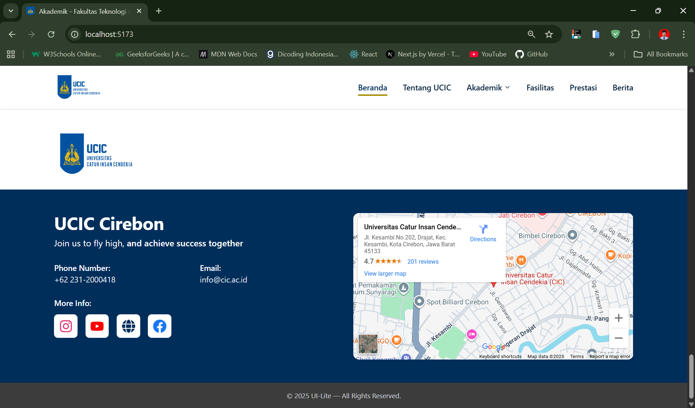

# 🌐 UCIC Cirebon Website


Repository ini berisi source code untuk website **UCIC Cirebon** yang dibuat menggunakan **React.js**, **Vite**, dan **TailwindCSS**.

---

## 🚀 Teknologi yang Digunakan

- [React.js](https://react.dev/) – Library JavaScript untuk membangun UI interaktif
- [Vite](https://vitejs.dev/) – Build tool super cepat untuk React
- [TailwindCSS](https://tailwindcss.com/) – Utility-first CSS framework
- [React Icons](https://react-icons.github.io/react-icons/) – Ikon ringan dan mudah digunakan

---

## 📦 Instalasi

Ikuti langkah-langkah berikut untuk menjalankan project di lokal:

### 1. Clone Repository

```bash
git clone https://github.com/username/ucic-cirebon-website.git
cd ucic-cirebon-website
```

### 2. Install Dependencies

Pastikan Anda sudah menginstal [Node.js](https://nodejs.org/) minimal versi **16**.

```bash
npm install
```

### 3. Jalankan Development Server

```bash
npm run dev
```

Buka di browser:

```
http://localhost:5173
```

### 4. Build untuk Production

```bash
npm run build
```

Untuk menjalankan hasil build:

```bash
npm run preview
```

---
## 📸 Screenshots

### 🏠 Home Page
  
  
  
  
  


---
